# VAZ Projects Website
This is the repository for [VAZ Projects](https://vazprojects.com), my personal blog and project log. Its main purpose is to serve as a sandbox for my DevOps learning journey.


## Architecture Overview
The project consists of a Django application running on multiple EC2 instances within an Auto Scaling group. Traffic is routed to these instances using Traefik as the load balancer. A self-managed PostgreSQL instance is used as the database. Static and user-uploaded files are served through CloudFront.


GitLab is used for continuous integration and continuous delivery. Development takes place on feature branches. New commits trigger a pipeline, which builds container images, runs tests, and deploys to a staging environment. A successful merge to the production branch triggers deployment to the production environment.

A Grafana/Prometheus/Loki stack is used to monitor user activity, application performance and instance resource utilization as well as ingesting logs for different services.


## Running Locally


### Install Dependencies
```sh
# Install Docker, Buildx, Docker Compose and mkcert.
pacman -S docker docker-buildx docker-compose mkcert	# On Arch Linux.
```

You might need to enable buildx by default with `docker buildx install`.


### Project Setup

```sh
# Clone the repository.
git clone https://gitlab.com/marcelotsvaz/vaz-projects.git
cd vaz-projects/

# Create certificates with mkcert.
mkdir -p deployment/tls/

mkcert -ecdsa -install	# If not done yet.
mkcert -ecdsa -key-file deployment/tls/websiteKey.pem -cert-file deployment/tls/website.crt localhost minio
```


### Start Compose Project
Make sure you have ports 80, 443, 8080, 9000 and 9001 available.
```sh
# Build the application image and start all containers.
docker compose up --detach --build

# Create account for Django admin.
docker compose run --rm application 'manage.py createsuperuser'
```

The following URLs will be available:
- Application: https://localhost
- Django admin: https://localhost/admin
- Traefik dashboard: https://localhost:8080
- MinIO console: https://localhost:9001


### Running Tests
```sh
# Run unit tests and generate coverage report.
docker compose run --rm --build application 'coverage run manage.py test && coverage report'
```


### Development
```sh
# Mount the application folder and the compiled LESS file into the container so you can test changes without rebuilding the image.
docker compose -f compose.yaml -f development.compose.yaml up --detach --build
```


### Cleanup
```sh
# Stop and remove all containers, data is preserved in named volumes.
docker compose down

# Stop and remove all containers, including volumes.
docker compose down --volumes
```